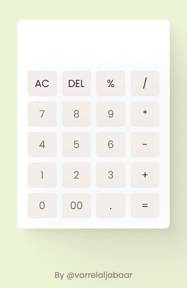

# Calculator
This repository contains a simple implementation of a web calculator using HTML, CSS, and JavaScript. This calculator is designed to provide an intuitive and comfortable user experience in performing basic calculations.

- Clean Interface: Simple and easy to understand design to make using the calculator comfortable.
- Basic Operations: Full support for addition, subtraction, multiplication, and division.
- Interactive: Quick responses and animated effects make using the calculator more enjoyable.
